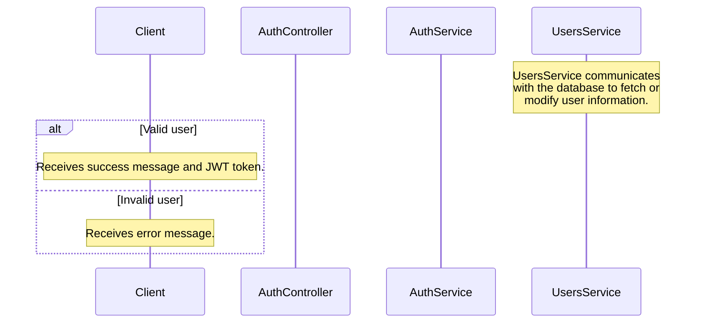

# Auth

## Sequence Diagram

```mermaid

sequenceDiagram
  autonumber
  participant C as Client #1
  participant AC as AuthController #2
  participant AS as AuthService #3
  participant US as UsersService #4

  #1: Client - The user/client who sends the request to the server for login or register.
  #2: AuthController - The controller that handles the incoming requests from the client, performs necessary validations and calls the AuthService to perform the login or register operation.
  #3: AuthService - The service layer that processes the login or register request and performs necessary business logic such as authentication, generating JWT token, and validating user information using the UsersService.
  #4: UsersService - The service layer that communicates with the database and fetches or modifies user information.

  #1: C->>+AC: Sends login or register request to AuthController.
  #2: AC->>+AS: Calls login or register function of AuthService.
  #3: AS->>+US: Calls UsersService function to fetch or modify user information.
  Note over US: UsersService communicates<br>with the database to fetch or<br>modify user information.

  alt Valid user
    #4: US-->>-AS: Returns user information.
    #3: AS-->>-AC: Returns success message and JWT token.
    #2: AC-->>-C: Returns success message and JWT token.
    Note over C: Receives success message and JWT token.
  else Invalid user
    #4: US-->>-AS: Returns null.
    #3: AS-->>-AC: Returns error message.
    #2: AC-->>-C: Returns error message.
    Note over C: Receives error message.
  end

```
