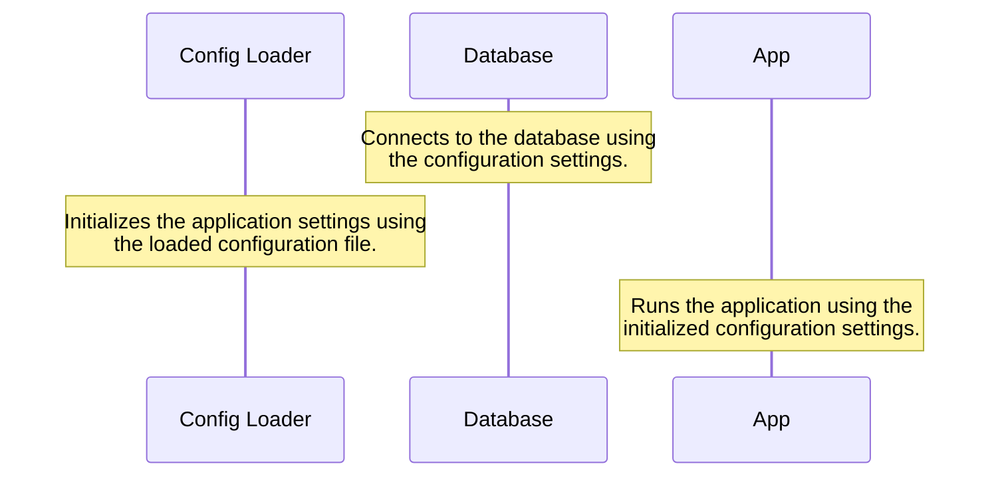

# Config

## Sequence Diagram

```mermaid
sequenceDiagram
  autonumber
  participant ConfigLoader as Config Loader #1
  participant Database as Database #2
  participant App as App #3

  #1: ConfigLoader - Loads the configuration file and initializes the application settings.
  #2: Database - Connects to the database using the database configuration settings.
  #3: App - Runs the application and listens for incoming requests.

  #1: ConfigLoader->>+Database: Loads database configuration settings.
  Note over Database: Connects to the database using<br>the configuration settings.
  #2: Database-->>-ConfigLoader: Returns database connection status.
  Note over ConfigLoader: Initializes the application settings using<br>the loaded configuration file.
  #1: ConfigLoader->>+App: Loads application settings.
  Note over App: Runs the application using the<br>initialized configuration settings.
  #3: App-->>-ConfigLoader: Returns application status.
```
